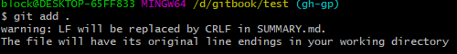

# ``git add .`` ```warning: LF will be replaced by CRLF in XXXXXXXXXXXXXX.```

## git add “目录”

在使用git的时候，每次执行

```bash
$ git add .
```

都会提示这样一个警告消息：

```bash
$ warning: LF will be replaced by CRLF in XXXXXXXXXXXXXX.`
```



虽然说没有什么影响吧。

不过就是觉得太碍眼了，

按照这样设置就没有问题了:

```bash
$ git config core.autocrlf false
```

这样设置git的配置后在执行add操作就没有问题了。

--------------------- 

参考文献：[CSDN](https://blog.csdn.net/qq_21383435/article/details/79722276) 

