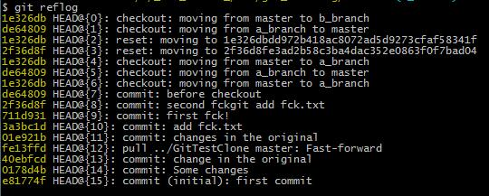

* 删除一个已被终止的分支

  如果需要删除的分支不是当前正在打开的分支，使用branch -d直接删除
```bash
git branch -d <branch_name>
```

* 删除一个正打开的分支

  如果我们在试图删除一个分支时自己还没转移到另外的分支上，Git就会给出一个警告，并拒绝该删除操作。

  如果坚持要删除该分支的话，就需要在命令中使用-D选项。

```bash
git branch -D <branch_name>
```

* 恢复被删除的分支

  Git会自行负责分支的管理，所以当我们删除一个分支时，Git只是删除了指向相关提交的指针，但该提交对象依然会留在版本库中。

  因此，如果我们知道删除分支时的散列值，就可以将某个删除的分支恢复过来。在已知提交的散列值的情况下恢复某个分支：

```bash
git branch <branch_name> <hash_val>
```

  如果我们不知道想要恢复的分支的散列值，可以用`reflog`命令将它找出来。如：

  

* reflog命令：

  显示整个本地仓储的commit，包括所有branch的commit，甚至包括已经撤销的commit。

  只要HEAD发生了变化， 就会在reflog里面看得到。

  这时恢复分支a_branch分支如下：
  
```bash
git branch <branch_name> HEAD@{4}
```